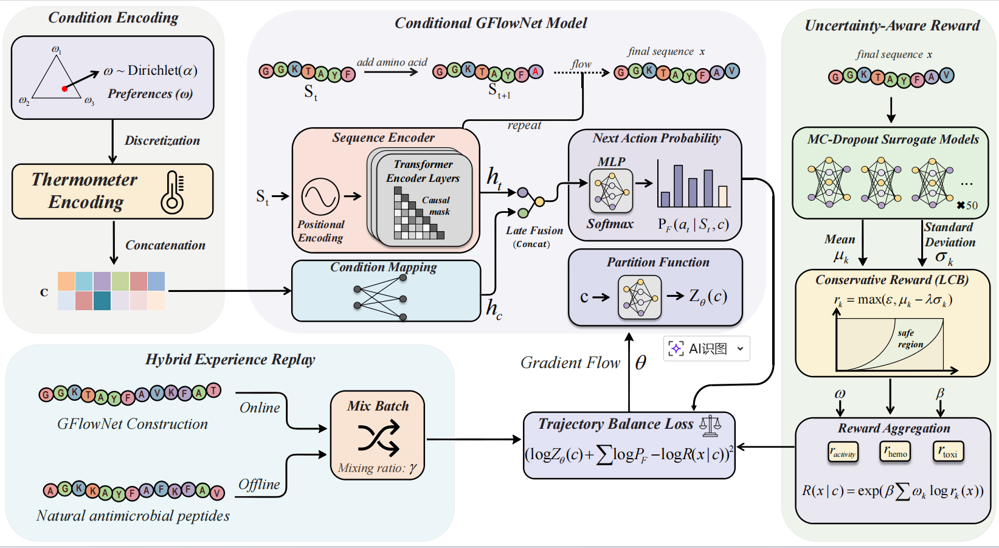

# HUGFN-AMPs: Hybrid Uncertainty-aware Generative Flow Networks for Antimicrobial Peptides Generation

This repository contains the official PyTorch implementation of the paper **"HUGFN-AMPs: Hybrid Uncertainty-aware Generative Flow Networks for Antimicrobial Peptides Generation"**.

## Overview
The continuous escalation of antimicrobial resistance (AMR) is a pressing global health crisis. Antimicrobial peptides (AMPs) are highly anticipated therapeutic candidates due to their broad-spectrum activity and low propensity for resistance. However, the *de novo* computational design of AMPs faces two critical bottlenecks:
1. **Complex Multi-Objective Optimization (MOO):** Candidates must maximize antimicrobial activity while strictly minimizing detrimental side effects like toxicity and hemolysis.
2. **Reward Hacking:** Deep generative models often exploit the epistemic uncertainty of surrogate models in out-of-distribution (OOD) sequence spaces, leading to spuriously high scores for biologically inviable sequences.

To overcome these challenges, we introduce **HUGFN-AMPs**, a unified and robust algorithmic framework based on Conditional Generative Flow Networks (GFlowNets). 

### Key Features & Contributions

*   **Multi-Objective Preference Conditioning:** HUGFN-AMPs integrates continuous preference conditioning, allowing a single generative policy to efficiently explore and balance multiple competing objectives (activity, low toxicity, low hemolysis).
*   **Uncertainty-Aware Reward Mechanism (LCB):** By utilizing Monte Carlo dropout to quantify epistemic uncertainty, the framework introduces a Lower Confidence Bound (LCB) penalty. This mechanism conservatively bounds the exploration in OOD regions, effectively mitigating "reward hacking."
*   **Hybrid Online-Offline Trajectory Mixing:** We combine real-time online exploration with offline trajectory mixing derived from natural biological datasets. This strategy anchors the vast exploratory space, significantly accelerating model convergence while preserving the physicochemical fidelity of natural AMPs.
*   **In Silico Validation:** Candidates generated by HUGFN-AMPs have been rigorously evaluated using AlphaFold2 for 3D structural modeling and molecular docking (HDOCK), demonstrating highly ordered α-helical conformations and favorable binding affinities to critical targets (e.g., FabG in *S. aureus* and *E. coli*).

## Framework Architecture



## requirements

- torch==2.0.0
- botorch==0.8.4
- hydra-core==1.3.2
- wandb
- matplotlib
- polyleven
- pymoo==0.5.0
- tqdm
- cachetools
- cvxopt==1.3.0
- plotly
- omegaconf
- randomname

## Train

The training process with default parameters requires a GPU card with at least 10GB of memory.

Run `main.py` using the following command:

```bash
CUDA_VISIBLE_DEVICES=<gpu_num> python main.py \
    task=amp \
    algorithm=offline_mogfn \
    tokenizer=protein \
    algorithm.train_steps=10000 \
    algorithm.batch_size=256 \
    algorithm.eval_freq=2000 \
    algorithm.num_samples=128 \
    exp_name=amp \
    seed=123 \
    algorithm.state_save_path="./data/amp.pkl.gz" \
    algorithm.sample_beta=16
```

The `exp_name` is the directory name to store the trained model and logs. Other configurations can be modified inside the config files or via command line arguments.

It takes about 14 hours to run the training script with default parameters using a single A5000 GPU.

## Generate

Use `sample_with_preference.py` to generate antimicrobial peptide sequences with specified preference vectors.

```bash
python sample_with_preference.py [-h] [--task TASK] [--num_samples NUM_SAMPLES] 
                                  [--prefs PREFS] [--output OUTPUT] 
                                  [--interactive] [--list_runs]
```

**Positional arguments:** None

**Optional arguments:**

| Argument | Description |
|----------|-------------|
| `-h, --help` | Show the help message and exit |
| `--task TASK` | Task name (e.g., amp_10, amp_12, amp_13). Default: amp_10 |
| `--num_samples NUM_SAMPLES` | Number of sequences to sample. Default: 5000 |
| `--prefs PREFS` | Preference vector (JSON array or comma-separated, e.g., "[0.5,0.3,0.2]"). Values should sum to 1.0 |
| `--output OUTPUT` | Output CSV file path. Default: sampling_results.csv |
| `--interactive` | Interactive mode: prompt for preferences |
| `--list_runs` | List all available runs |

To list all available trained models:

```bash
python sample_with_preference.py --list_runs
```

To run generation with specified preferences:

```bash
python sample_with_preference.py --task amp_10 --prefs "[0.5,0.3,0.2]" --num_samples 5000
```

To run generation in interactive mode:

```bash
python sample_with_preference.py --task amp_10 --interactive --num_samples 5000
```

The output is a CSV file containing the generated sequences and their reward scores.
